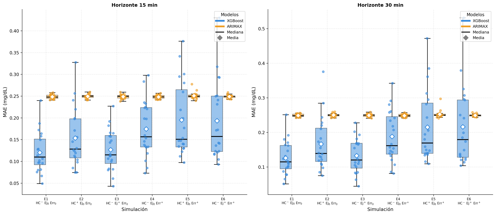
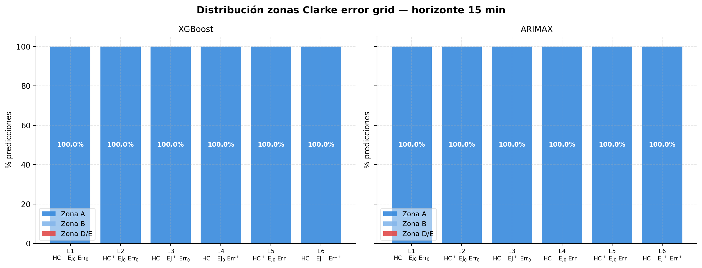
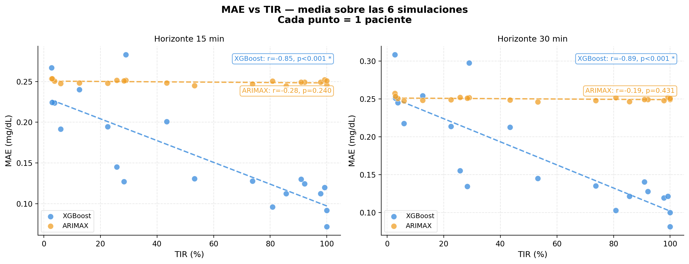

# Estudio comparativo de modelos predictivos para series temporales de glucemia en pacientes con diabetes tipo 1 en régimen MDI

**Autor**: Guillermo de la Fuente Abajo  
**Tutores**: Antonio Jesús Canepa Oneto y Ruth Estefanía Santos Mazo  
**Universidad**: Universidad de Burgos  
**Titulación**: Grado en Ingeniería de la Salud  
**Curso académico**: 2025/2026  

---


[](https://skforecast.org)
[](https://github.com/illinoistech-itm/py-mgipsim)


Estudio comparativo de los modelos ARIMAX y XGBoost para la predicción
de glucemia a 15 y 30 minutos en pacientes con DM1 en régimen de
múltiples dosis diarias de insulina (MDI), sobre datos generados con
el simulador py-mgipsim.

## Introducción

La diabetes mellitus tipo 1 (DM1) es una enfermedad autoinmune que
requiere la administración exógena de insulina de por vida. El régimen
de múltiples dosis diarias (MDI) es la modalidad terapéutica
mayoritaria a nivel global.

La predicción anticipada de la glucemia a corto plazo (15-30 minutos)
permite al paciente tomar decisiones preventivas antes de que se
produzcan episodios de hipo o hiperglucemia. Este trabajo compara dos
enfoques complementarios —un modelo lineal estocástico (ARIMAX) y un
modelo de gradient boosting (XGBoost)— bajo condiciones experimentales
controladas que aíslan el efecto de tres factores clínicamente
relevantes: la variabilidad en la ingesta de hidratos de carbono, la
práctica de ejercicio físico y el error en el cálculo de la dosis de
insulina.

Los datos han sido generados con el simulador py-mgipsim, que implementa el
modelo metabólico UVA/Padova sobre una cohorte de 20 pacientes
virtuales con DM1, en seis escenarios experimentales durante 30 días
simulados.

## Estructura del repositorio

```
TFG-GIS-Predictor-glucosa/
├── py-mgipsim-main/SimulationResults/   # Datos brutos del simulador
├── Simulaciones/                        # Datos serializados y parámetros
├── Memoria/                             # Documento del TFG
└── Analisis_y_resultados/               # Notebooks, código y resultados
    ├── Comprobar_simulaciones.ipynb
    ├── Pipeline.ipynb
    ├── Funciones.py
    ├── guardar_df.py
    └── Resultados/
```

## Instalación

```bash
git clone https://github.com/WillyFtAb/TFG-GIS-Predictor-glucosa.git
cd TFG-GIS-Predictor-glucosa
conda env create -f environment.yml
conda activate tfg-glucosa
```

## Uso

. Ejecutar `Comprobar_simulaciones.ipynb` para visualizar las series
   temporales de glucemia por paciente y escenario.
2. Ejecutar `Pipeline.ipynb` para reproducir el análisis completo:
   preprocesamiento, ingeniería de características, optimización de
   hiperparámetros, backtesting y evaluación.

Para generar nuevos datos, instalar py-mgipsim e indicar la ruta
de los ficheros en `guardar_df.py`. Véanse los Anexos D y E de la
memoria para instrucciones detalladas de instalación y uso.

## Resultados principales

Los modelos se evaluaron sobre 120 series temporales independientes
(20 pacientes × 6 escenarios × 2 horizontes: 15 y 30 minutos).

- **ARIMAX (p=2, d=0, q=3):** rendimiento estable en todos los
  escenarios e insensible a las perturbaciones exógenas, con un
  perfil de seguridad clínica más conservador.
- **XGBoost** (n_estimators=301, max_depth=9, learning_rate=0.040):
  menor MAE en condiciones favorables, con mayor sensibilidad al
  error en la dosis de insulina y a la variabilidad en la ingesta
  de hidratos de carbono.

  

- El 100% de las predicciones se clasificaron en zona A de la
  Clarke Error Grid en todos los escenarios, modelos y horizontes,
  confirmando la validez clínica de las predicciones sobre datos
  simulados.

  
  
- Se identificó una correlación negativa significativa entre el
  tiempo en rango (TIR) del paciente y el error predictivo de
  XGBoost, ausente en ARIMAX.

  

## Limitaciones

Los resultados se han obtenido íntegramente sobre datos generados por el
simulador py-mgipsim y no han sido validados con datos reales de
pacientes. La regularidad de las series simuladas produce un escenario
de predicción más favorable que el esperado en condiciones clínicas
reales, por lo que los valores de error reportados no son directamente
extrapolables a datos reales sin validación previa.

  
## Licencia

MIT License — véase [LICENSE](LICENSE).
